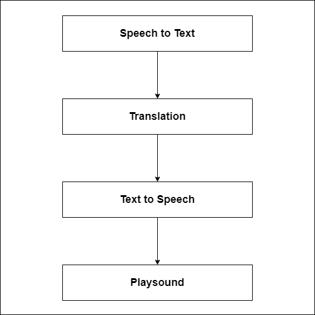

# Live Language Translation

## 01 Introduction

A voice recognition-based tool for translating languages in real-time. This tool serves as a virtual interpreter, offering users a convenient and efficient way to bridge language gaps. Inspired by the natural process of human translation, the tool listens to spoken words and converts them into the target language, replicating the fluidity and accuracy of a human translator.

 

 ## 02 Technology Stack

 - Python (v3.8.5 Recommended)
 - GTTS Module
 - SpeechRecognition Module
 - Streamlit UI Module 
 - Pygame Module
 - Googletrans (v3.1.0a0 Recommended)

 ## 03 System Architeture Diagram

 

